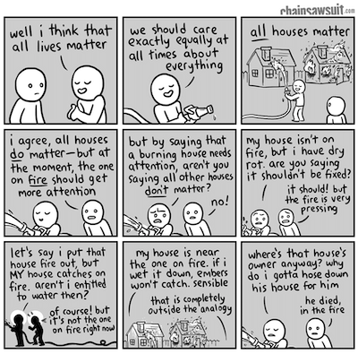
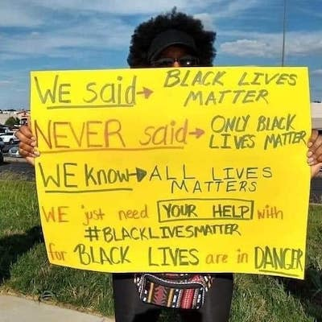

# A linguistic perspective: The harmful effects of responding "All lives matter" to "Black lives matter"

In this linguistic perspective, we take on the response that is often given to "Black lives matter": "All lives matter". We'll go through why, in linguistic terms, even though we presumably all agree that all lives matter, it is hurtful, dismissive, and cruel as a response to "Black lives matter" -- whether or not that effect is intended on the part of the person who says it. We're not saying anything here that hasn't already been expressed in poignant memes and songs, some of which you'll find interspersed in this post. We just provide a linguist's perspective. 

The phrase "Black lives matter" first rose to prominence in 2013. This was the year that George Zimmerman was acquitted in the murder of Trayvon Martin, a black teenager who was walking home when Zimmerman shot him in 2012. The outrage over Zimmerman's acquittal spurred the Black Lives Matter movement. Starting out as a hashtag, it has since become a well-known international activist movement that campaigns against violence and systemic racism toward Black people. The movement's rallying cry, "Black lives matter," expresses both the belief that Black lives should matter as much as other lives and the frustration that Black lives in fact currently are treated as less worthy, and functions as a call to action to address institutional racism. It has been met both with increasingly widespread support, but also with the response we analyze here: "All lives matter." So, what's the problem with this response?

<!--  -->

Let's start with pizza. Say your friend is putting in an order for movie night and asks you what you want on your pizza. You say "I want pepperoni." The equivalent to responding "All lives matter" to "Black lives matter" is for your friend to respond to you with "Do you mean you want pepperoni, pizza sauce, and cheese?" Of course that's what you mean. It's obvious that you want the pizza sauce and cheese, so you didn't think you had to say it. You wanting pizza sauce and cheese on your pizza is something you assumed was in what linguists call *common ground* between you and your friend -- information that's shared and doesn't need to be made explicit. Forcing you to be explicit about the pizza sauce and the cheese is... weird. You might rightfully react to this friend by thinking they're being annoyingly pedantic -- why should you have to spell out the obvious? What a waste of time. 

How is this relevant to the mattering lives case? To put it simply: Black lives are the pepperoni, non-Black lives are the pizza sauce and cheese [1](#foot1). We already know that non-Black lives matter, in the same way we know that pizza sauce and cheese belong on pizza without having to say so. It's the Black lives that society at large has led us to believe may not matter. So, given that it's already in common ground that non-Black lives *do* matter, reaffirming that Black lives matter resolves the uncertainty that results from the tension of the belief that all lives *should* matter and the recognition that society treats Black people in ways that suggest their lives *don't* matter, or matter less than those of non-Black people.

A different way to think about this is in terms of what linguists call the *Question Under Discussion*, or QUD for short. Whenever we're talking to someone, there's a conversational goal we're trying to achieve, a question (or multiple questions) we're trying to answer. In the pizza case, there are two salient QUDs your utterance of "I want pepperoni" could be an answer to, shown in the first column of the table.

| Salient QUD  | Interesting states of the world | Alternative to "I want pepperoni" | Interpretation of "I want pepperoni"|
| ------------- | ------------- | ------------- | ------------- |
| Do you want pepperoni on your pizza?  | want pepperoni /   don't want pepperoni  | "I don't want pepperoni" | I want pepperoni on my pizza (in addition to anything else that can be assumed to be in common ground, like pizza sauce and cheese). |
| What do you want on your pizza?  | want only pepperoni (no pizza sauce or cheese) /   want pepperoni, pizza sauce, and cheese  | "I want pepperoni, pizza sauce, and cheese" | I want only pepperoni on my pizza, and nothing else. |

<!--
Salient QUDs:
1. Do you want pepperoni on your pizza?
2. What do you want on your pizza? 

Interesting states of the world under each QUD:
1. {I want pepperoni on my pizza; I don't want pepperoni on my pizza}
2. {I want only pepperoni on my pizza (and not pizza sauce or cheese); I want pepperoni, pizza sauce, and cheese on my pizza} 

Salient utterance alternatives:
1. {"I want pepperoni"; "I don't want pepperoni"}
2. {"I want pepperoni"; "I want pepperoni, pizza sauce, and cheese"}

Interpretation of "I want pepperoni":
1. I want pepperoni on my pizza (in addition to anything else that can be assumed to be in common ground, like pizza sauce and cheese).
2. I want only pepperoni on my pizza, and nothing else.

-->

A QUD is essentially a way of capturing which world states we're interested in distinguishing between. The relevant world states that the pepperoni QUDs correspond to are shown in the second table column. Intuitively, the first QUD  corresponds to wanting to know *whether or not you want pepperoni* on your pizza. The second QUD corresponds to wanting to know *the exhaustive list of toppings you want* on your pizza. Under the first QUD, all we're interested in is the pepperoni -- the pizza sauce and cheese just aren't what's under discussion right now. But under the second QUD, we're actively considering the possibility that perhaps you really only want pepperoni and nothing else on your pizza, implausible as that may be.

When we interpret something someone says, we always do it against a backdrop of alternative things that person could have said -- what linguists call *utterance alternatives*. In different contexts, there are different salient utterance alternatives. A QUD makes certain utterance alternatives more salient than others. For instance, the salient utterance alternatives for our pizza QUDs are shown in the third table column. Under both QUDs, "I want pepperoni" is a useful thing to say for the purpose of distinguishing between the world states we're interested in, but the alternatives we think the speaker could have used differ. Under the "Do you want pepperoni" QUD, saying "I want pepperoni" just contrasts with "I don't want pepperoni" -- it doesn't say anything about pizza sauce and cheese. You just assume your friend will fill in the pizza sauce and cheese business in the way most justified by what's in common ground. That is, you'll assume your friend will infer you'll want pepperoni *in addition* to the pizza sauce and cheese.

Things are different under the "What do you want on your pizza" QUD. In this case, saying "I want pepperoni" contrasts with the alternative "I want pepperoni, pizza sauce, and cheese". This is a case where something happens that linguists call a *Quantity inference* or an *exhaustivity inference*, which results from the assumption that people are generally cooperative and try to resolve the QUD (whether or not that assumption is warranted in a particular instance). Saying "I want pepperoni, pizza sauce, and cheese" resolves the "what do you want"-QUD definitively -- it is clear that you want pepperoni, pizza sauce, and cheese on your pizza. To make "I want pepperoni" resolve the same QUD, it needs to be interpreted as "I want only pepperoni on my pizza (and not pizza sauce or cheese)". 

What does this mean for the mattering lives case? Here is the relevant table, by analogy:

<!--
Salient QUDs:
1. Do Black lives matter?
2. Which lives matter?

Interesting states of the world under each QUD:
1. {Black lives matter; Black lives don't matter}
2. {Only Black lives matter; Black lives and non-Black lives matter}

Salient utterance alternatives:
1. {"Black lives matter"; "Black lives don't matter"}
2. {"Black lives matter"; "All lives matter"}

Interpretation of "Black lives matter":
1. Black lives matter (in addition to non-Black lives, which can be assumed to be in common ground).
2. Only Black lives matter.
-->

| Salient QUD  | Interesting states of the world | Alternative to "I want pepperoni" | Interpretation of "I want pepperoni"|
| ------------- | ------------- | ------------- | ------------- |
| Do Black lives matter?  | Black lives matter /   Black lives don't matter  | "Black lives don't matter" | Black lives matter (in addition to non-Black lives, which can be assumed to be in common ground). |
| Which lives matter? | Only Black lives matter /   Black lives and non-Black lives matter  | "All lives matter" | Only Black lives matter. |

<!--  -->

**When people say "Black lives matter", they are addressing the QUD "Do Black lives matter?". They simply aren't saying anything about non-Black lives. We can just be expected to fill in what we already know about non-Black lives with what's in common ground -- which is, that non-Black lives matter, of course, it's just not what's under discussion right now. People who respond with "All lives matter" are (intentionally or unintentionally) interpreting "Black lives matter" as a response to the "Which lives matter?" QUD, and therefore wrongly interpret it as "Only Black lives matter."** 

A response to this explanation has been that the problem is the ambiguity in what the QUD is that's being addressed and that it's up to Black people to make clear which QUD is being addressed by instead saying "Black lives *do* matter" or "Black lives matter, *too*". We agree with the first part of this and strongly disagree with the second part. We'll spend the rest of this post saying why. 

The QUD is something we infer, rather than an explicit question that is asked and can be taken to be shared. For instance, if someone asks "Do you have any kids?", the question itself is answered simply by saying "Yes" or "No" -- but you'll find that people routinely go beyond that and say "Yeah, I have 2 awesome girls". They've inferred that the QUD isn't just "Do you have any kids?" but "How many kids do you have, and what are they like?". In fact, it may be perceived as rude and uncooperative to just respond "Yes". What this points to is that we expect what people say to be informative with respect to a QUD that isn't necessarily already given in the discourse, but that we instead have to infer on the fly and respond to appropriately. We do this all the time, without thinking about it. The response itself can either reinforce the originally intended QUD or force a change in it. These reinforcements or changes are themselves something that people track and have reactions to. So, if my intended QUD is "How many kids do you have and what are they like?", but out of politeness I ask "Do you have any kids?", your "Yeah, I have 2 awesome girls" response reinforces my intended QUD by recognizing and responding to it, thereby also solidifying our common ground. It's the cooperative thing to do on your part, and you do it by recognizing that I wasn't as explicit as I could have been, and the reason for that is that it would have been possibly impolite but also unwieldy to say "How many kids do you have and what are they like"? Given past interactions with people about kids, we can be assumed to have common ground about what QUDs are generally ones that we're interested in, so I don't need to be unwieldy -- I can just rely on you to infer what the intended QUD is and respond to it accordingly. In contrast, if you simply respond "Yes", you're shifting the QUD to "Do you have any kids?", which is weaker than the intended QUD (in the sense that an answer to it provides less information) and therefore results in a perception of aloofness, rudeness, or uncooperativeness. 

The gist of the problem with responding "All lives matter" has been very succinctly captured in the 2017 Body Count song ["No Lives Matter"](https://www.youtube.com/watch?v=hlk7o5T56iw). They say: 

> When I say 'Black Lives Matter' and you say 'All Lives Matter' [...] \
> You're diluting what I'm saying \
> You're diluting the issue \
> The issue isn't about everybody, it's about Black lives, at the moment

<!--  -->

In linguistic terms: the response **"All lives matter" forcefully shifts the intended QUD "Do Black lives matter?" to "Which lives matter?"** -- a QUD that's as irrelevant as the question of whether you want pizza sauce and cheese on your pizza. But unlike the pizza domain, where very little is at stake and your reaction will be at most one of "Stop being pedantic", in the mattering lives  case what the QUD shift does is much more violent. It denies the relevance of the intended "Do Black lives matter?" QUD, which is itself the result of the historical and current institutional violence and systemic racism against Black people. **By denying the relevance of the "Do Black lives matter?" QUD, "All lives matter" also denies the history of hurt, dismissal, and oppression that makes the "Do Black lives matter?" QUD salient in the first place.** That is why the response is so insidious: it is a statement that we should generally agree with, yet in response to "Black lives matter" it ends up denying a history of violence against Black people.

[XXX end here and relegate the next paragraph to the "Resources" section?]

So, if you find yourself wanting to respond "All lives matter", "White lives matter", or "Blue lives matter", ask yourself why "Which lives matter?" is a more salient QUD to you than "Do Black lives matter?" And why it's so salient to you that you're willing to give up the assumption of cooperative discourse -- that "Black lives matter" is a good faith response to a societally salient QUD. If it's that you don't believe the premise that Black people are treated worse in America than non-Black people, we have listed some resources below that contain ample evidence.

[XXX A closing note?] One might argue that "Black lives matter" and "All lives matter" are no longer transparent utterances that should be analyzed as regular things people say that result in regular meanings according to the regular implicit rules of conversation. That, instead, they are like chants that identify you as belonging to a particular group, similar to sports team chants. We don't disagree but find it nevertheless useful to give an account of the origins of these "badges".

<a name="foot1">1</a>: We are assuming "Black" here includes everyone who identifies as BIPOC (Black, Indigenous, People Of Color).

## Additional resources [XXX should this be included at all?]

If you find yourself confused or attacked by the notion that Black people are treated worse by society than white people, here are a number of articles and books to read that document the situation:

- The following paper contains many references documenting the current state of American racism: Roberts, S. O., & Rizzo, M. (2020). [The Psychology of American Racism](https://osf.io/w2h73).
- The [Campaign Zero](https://www.joincampaignzero.org/) website contains lots of resources documenting how police violence disproportionately affects communities of color, and suggests policy solutions.
- Alexander, M. (2020). The new Jim Crow: Mass incarceration in the age of colorblindness. The New Press.
- XXX OTHERS?

XXX resources for getting deeper into the linguistic weeds of how QUDs, inferences, and common ground work?

